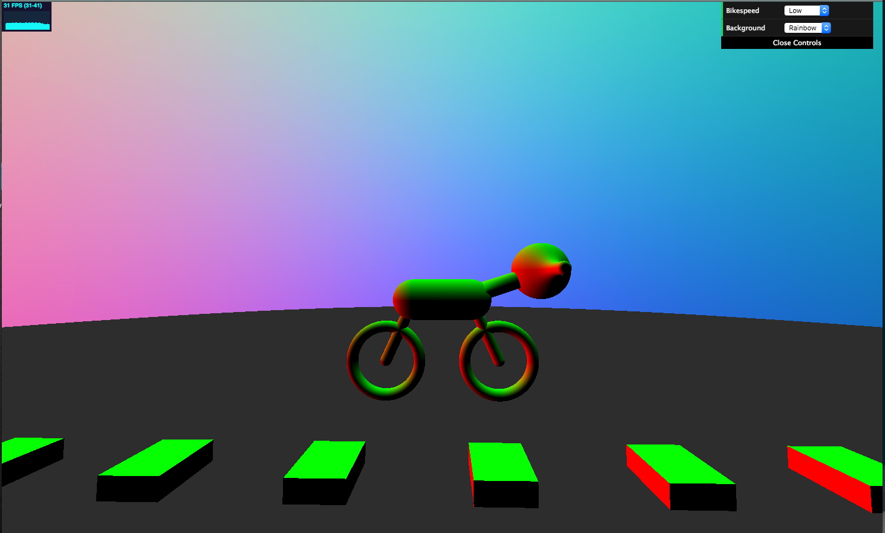

CIS 566 Homework 2: Raymarching SDFs
=====================================

Written by Julia Chun (hyojchun)

Project Results
----------------
### Resulting Image

A published demo can be found here : https://hjchun96.github.io/hw02-raymarching-sdfs/
   
Below is the final image generated by the code:

### Ray Casting Setup

### Scene Animation

* The SDF combination operations Intersection, Subtraction, and Smooth Blend
	1. Smooth Union (blend) used to create motorcycle handle
	2. 
	3.
	4.

* Raymarch optimization by way of bounding volumes around SDFs, arranged in a Bounding Volume Hierarchy 
	1. Spheremarching done, manually arranged in bounding volume hierarchy

* Animation of at least two scene attributes such as color, position, scale, twist, rotation, texture, or anything else you can think of
	1. Sine to change position up down
	2.

* At least two functions mentioned in the Toolbox Functions slides used for animation
 	1. Sine to change position up down
 	2. 

* Procedural texturing using toolbox functions and/or noise functions
	Road surface marking were generated using square wave. 
	Where the output of the square wave is greater than 0, a block was placed and vice versa,
	to achieve the effect of markings made in regular intervals.

* Shading that involves surface normal computation
	1. Lambert Shading

### GUI Features

Low Light   				 |  Medium Light     			| High Light     		 |
:-------------------:|:----------------------:|:-------------------:
  |  ||

References & Resources
----------------------
http://flafla2.github.io/2016/10/01/raymarching.html#multiple-materials
https://www.shadertoy.com/view/4tcGDr