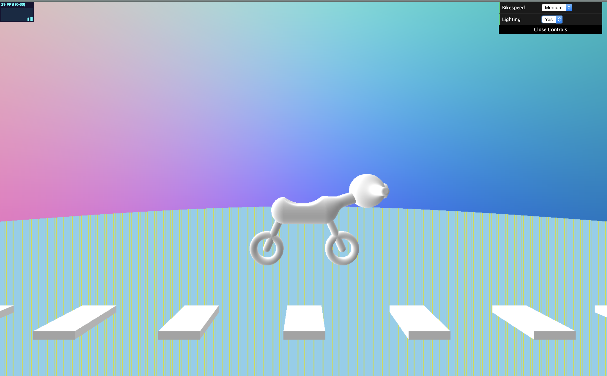

CIS 566 Homework 2: Raymarching SDFs
=====================================

Written by Julia Chun (hyojchun)

Project Results
----------------
### High Level Overview of Features

A published demo can be found here : https://hjchun96.github.io/hw02-raymarching-sdfs/
   
Below is the final image generated by the code:

* Ray Casting: Implemented conversion to compute correct ray cast direction.
* Scene Animation: Motorcycle that bounces up and down as it moves, as well as a road that moves past by it.
* Gui Features: Bike Speed & Background Color.
* Extra Credit: Ambient Occlusion

Implementation Details
----------------------
### Scene Animation

* Object Composition
	The motorcycle was created by applying multiple operations to primitives. In particular, I used
	1. Smooth blend on cylinder and shpere create bike head
	2. Smooth Subtraction of two round boxes of different sizes to create bike seat
	3. Intersection of a box and a shpere used to create the headlight attached to the bike head
	4. Cheap Bend used on the neck of the motorcycle to bend it the way that imitates real bike.
	4. Union of all the other remaning shapes to put the bike together.

* Raymarch Optimization 
	Spheremarching was done. ???? Objects were manually arranged in bounding volume hierarchy
	1. by way of bounding volumes around SDFs, arranged in a Bounding Volume Hierarchy 
	

* Animation of Scene
  1. The position of the bike was animiated using sin functions (toolbox function #1)
  2. The wheel sizes were animated 
	3. The Road surface markings were procedurally generated and placed using square wave (toolbox function #2).
		 Where the output of the square wave is greater than 0, a block was placed and vice versa,
	   to achieve the effect of markings made in regular intervals. 

* Procedural texturing using toolbox functions and/or noise functions:
	As explained above, the animated road surface markings created by blocks use square waves and count as texture (confirmed by TA).
	Additionally, the plain was given texture with striped pattern to give a more dreamy effect.

* Shading
	Basic lambert reflective shading 

### GUI Features
* Bike Speed: The user can toggle the bike speed between Low, Medium, and High (default is Medium). This controls
							the uniform float  `u_Bikespeed` 
* Background Color: The user can change the background color between 

References & Resources
----------------------
http://flafla2.github.io/2016/10/01/raymarching.html#multiple-materials
https://www.shadertoy.com/view/4tcGDr